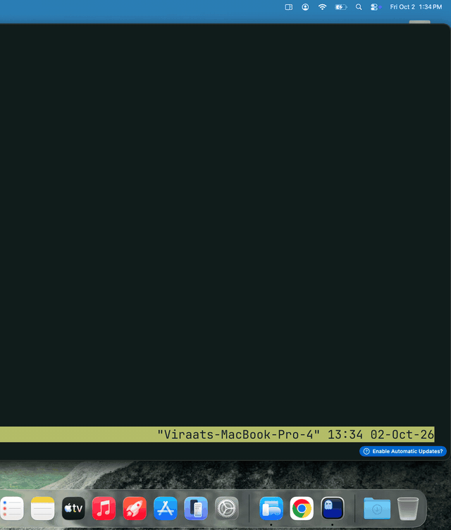

# muse-sidepanel

A small menu bar app that slides [Muse](https://muse.ai) (Meta's personal AI agent) out from the
edge of your Mac's screen, so you can pick up the conversation without switching to a browser tab.

It hosts the real muse.ai web app in a narrow panel, so chatting, replying and reacting work
exactly as they do on the website, and it follows the system light/dark appearance.



## Install

```sh
curl -fsSL https://raw.githubusercontent.com/viraatdas/muse-sidepanel/main/install.sh | bash
```

Or download the DMG from the [latest release](https://github.com/viraatdas/muse-sidepanel/releases/latest)
and drag the app to Applications. Requires macOS 14 or later. Sign in to Muse once inside the
panel; the session is kept between launches.

## Using it

| Do this | To |
| --- | --- |
| Swipe two fingers in from the trackpad's right edge | Open the panel, wherever the pointer is (it follows your fingers) |
| The same swipe again | Close it |
| `⌃⌥Space` | Toggle the panel from anywhere |
| Swipe two fingers toward the screen edge over the panel | Push it away |
| Click in another app, or `⌘W` | Hide it |
| Pin button in the header | Keep it open while you work elsewhere |
| Drag the panel's inner edge | Resize it |

The trackpad-edge swipe is the gesture macOS gives to Notification Center, so on first launch the
app asks whether to take it over (the same switch as System Settings → Trackpad → More Gestures →
Notification Center). Notification Center still opens from the clock, and "Trackpad Edge Swipe" in
the menu bar icon's menu flips it back. Without it, rest the pointer on the right screen edge and
swipe two fingers left.

The menu bar icon has the rest: which screen edge to use, launch at login, reload, and quit.

## Build from source

Requires Xcode command line tools (Swift 5.9+).

```sh
./scripts/build-app.sh --install   # builds, copies to /Applications, launches
swift test
```

`--install` also switches off Notification Center's edge swipe; `--restore-gesture` turns it back
on. Without `--install` the app is left in `build/Muse Sidepanel.app`. The script signs with a
Developer ID or Apple Development identity if one is in the keychain (override with
`SIGN_IDENTITY`), otherwise ad hoc. `swift scripts/make-icon.swift` regenerates the icon.

## Battery

- No timers and no global event taps. The screen-edge swipe is caught by a 3-point-wide invisible
  window that only receives events when the pointer is on it; the hot key is a system-registered
  Carbon hot key.
- The trackpad-edge swipe reads raw touch frames (private MultitouchSupport framework) while
  fingers are on the trackpad. Touches that don't start at the edge are discarded after one
  comparison; nothing runs when the trackpad is idle.
- The page is not loaded until the first time you open the panel.
- Hiding takes the window off screen, which makes WebKit throttle the page. After 15 minutes
  hidden the page is dropped entirely (toggle: "Free Memory When Idle") and reloads at the same
  conversation next time.
- Sliding moves one layer inside a fixed window, so it is composited on the GPU without redrawing
  the page. The settle animation's display link exists only while the card is moving.

## Layout

- `AppDelegate.swift` — menu bar item, menus, hot key, edge strips
- `PanelController.swift` — show/hide, slide animation, idle unload
- `SidePanel.swift` — the panel window, card chrome, resize handle, edge strip window
- `SwipeTracker.swift` — two-finger swipes over the screen edge and the panel
- `TrackpadEdge.swift` — two-finger swipe in from the trackpad's edge
- `NotificationCenterGesture.swift` — the system setting that swipe depends on
- `WebController.swift` — the WKWebView: navigation rules, downloads, dialogs

This is an unofficial wrapper around the public website and is not affiliated with Meta.
